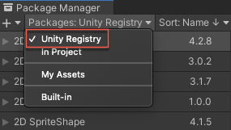
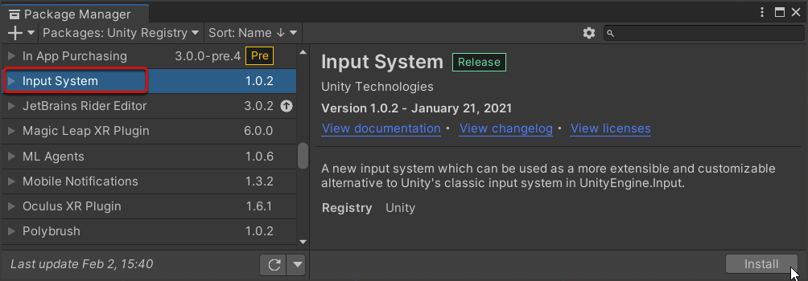
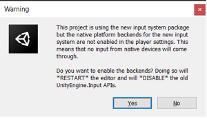
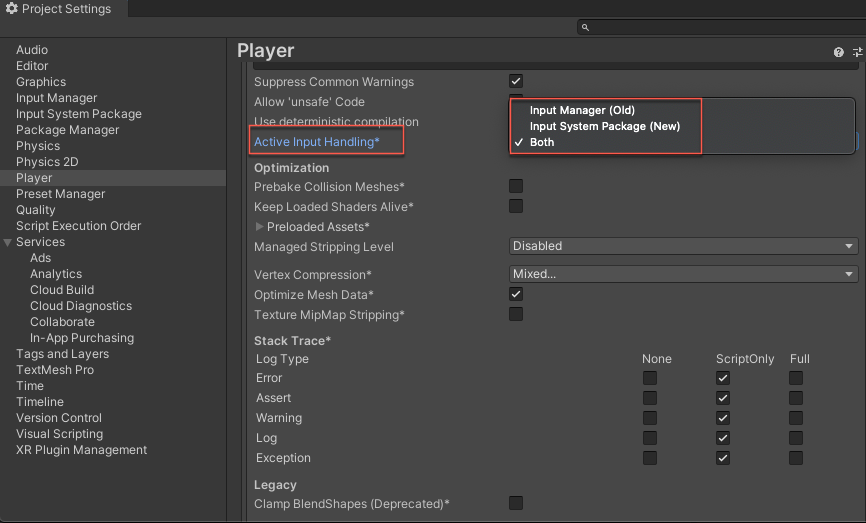
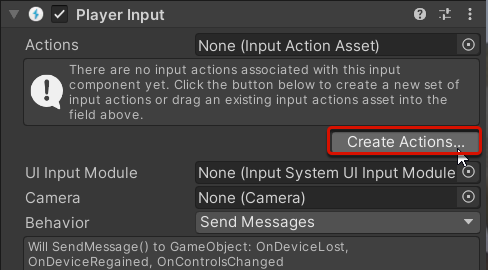
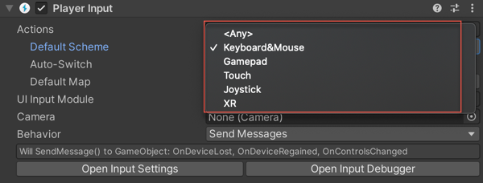
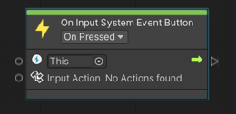
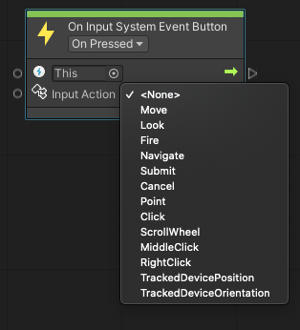
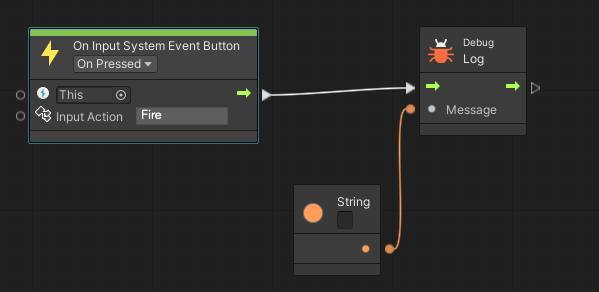

# Capturing player inputs using the input system

### Installing and setting up the input system package

To use the input system you must first install the new input system package.

#### To install the new input system package

1. Open the Package Manager window **Window** > **Package Manager**.

2. Select **Unity Registry**. 
   The Package Manager window appears.

   

3. In the package list, select **Input System.** 
   The Input System tab appears.

   
   
4. Select the **Install** button. 
   A Warning popup appears. 
   Note: If you plan to use only the new input system select **Yes** in the warning popup. 
   
   
   

The new player input system is installed.

The next step is to set up your project to use the new input system.

#### To setup your project to use the new input system

Note: Only complete the following task once you have the new input system installed.

1. Open the Project Settings window by selecting **Edit** > **Project Settings**.
2. Click on the Player item in the list and go to **Active Input Handling**. Set the input system to **Input System Package (New)** or **Both**.  
    
   The Unity Editor restarts to change the input system in use. 
3. To enable the new input system nodes, you need to regenerate the Units. In the Project Settings window, select **Visual Scripting** and select the **Regenerate Units** button. 

   

Your project is set up with the new player input system.

### Getting started using the new input system nodes

Once you have the new input system package installed and your project is set up you can add new input system event units:

- On Input System Event Button
- On Input System Event Float
- On Input System Event Vector 2

The first step is to add a Player Input component, after which you can add player units that use the new input system.

#### To add a Player Input component

1. In the **Hierarchy**, select a GameObject that has the input.
2. Select **Add Component**.
3. Select **Player Input**. 
   If you do not have any input Actions files, select the **Create Actions** button and save a new input file.        
   
4. Select the **Actions** selector.  
   The Select InputActionAsset window appears.
5. Select either the input file you created or an existing file in your project.
6. You can change the default input scheme from the **Default Scheme** drop-down. 

   

You can now interact with the input scheme and enter player input event units.

#### To enter a player input event unit

1. Create a new Script Machine on the GameObject.
2. Open the **Script Machine graph**. 
   Right-click on the graph background and open the fuzzy finder. 
   In the Event section (**Events** > **Input**), the new input system nodes are listed.
3. Select one of the three following event units. 
   - On Input System Event Button
   - On Input System Event Float
   - On Input System Event Vector 2 

     The selected input system event units appear. 
     
4. Select the **Input Action** to define the event to trigger. 

    
   Note: If the Input Actions list does not appear, you did not complete a previous step successfully

As an example of successfully installing and setting up the system and using one of the Input system event units, a debug message appears when you click the mouse button: 

This result appears when the application runs and the user clicks the mouse button. That is, the successful data setup happens if you see the Input Action list with data in it.

