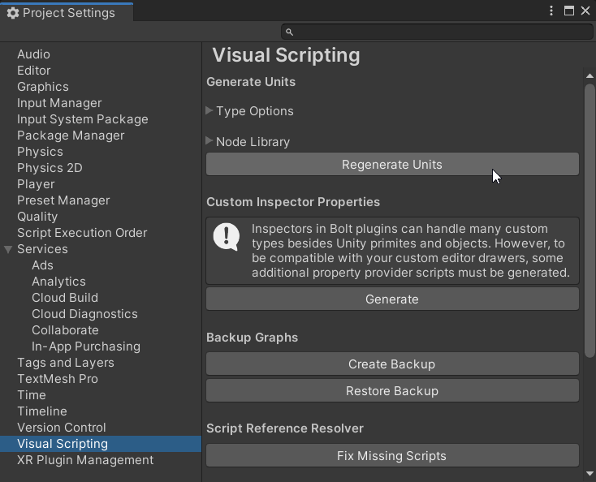
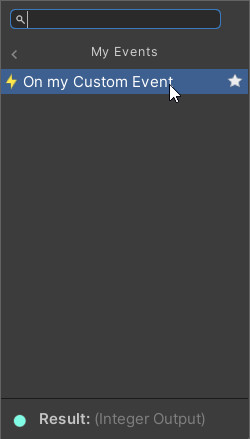
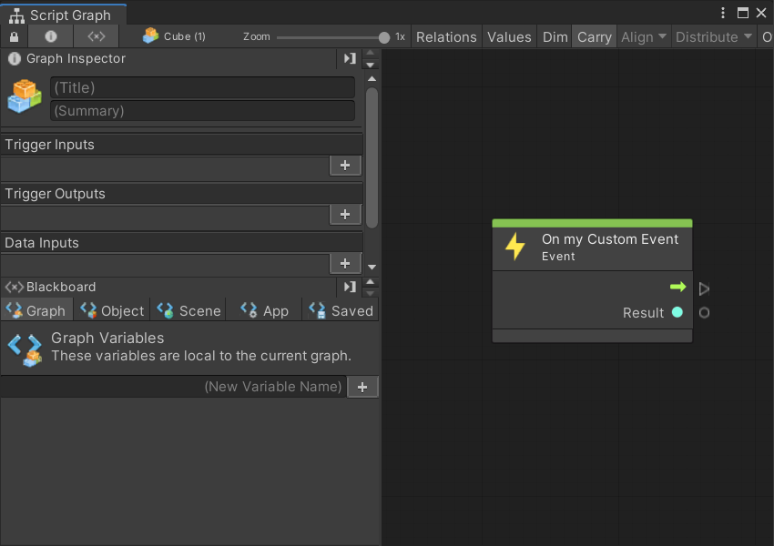
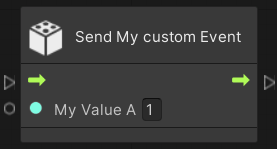
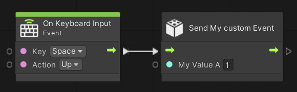
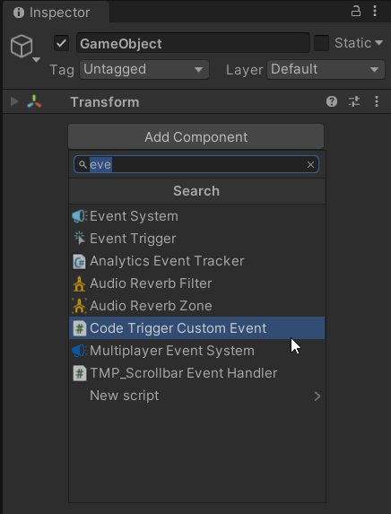
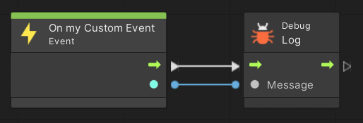

# Creating a custom visual script event unit

**Event** units are entry points to execute your actions, for example OnStart, OnUpdate, OnButton. You also need to create an **Event Sender** unit if you want other visual script graphs to be able to send events.

The process to create a custom visual event is as follows:


1. [Create a simple custom event sender unit.](#create-custom-event)
2. [Create a script that triggers your simple custom event through programming (within a C# script).](#triggers-custom-event)
3. [Create a script that listens to your custom event.](#create-script-listen-event)


<a name="create-custom-event"></a>
### Create a simple custom event unit

To create an empty event unit:

1. In your project, right-click and select **Create** > **C# Script** to create a new C# file in your project with the name of your event unit (for example, MyEventNode.cs).

2. Copy, paste, and save the following code in your script.

   ```C#
   using Unity.VisualScripting;
   using UnityEngine;
   
   //Registering a string name for your custom event to hook it to an event. You can save this class in a separated file and add multiple events to it as public static strings.
   public static class EventNames
   {
      public static string MyCustomEvent = "MyCustomEvent";
   }
   
   [UnitTitle("On my Custom Event")]//Custom EventUnit to receive the event. Adding On to the unit title as an event naming convention.
   [UnitCategory("Events\\MyEvents")]//Setting the path to find the unit in the fuzzy finder in Events > My Events.
   public class MyCustomEvent : EventUnit<int>
   {
      [DoNotSerialize]// No need to serialize ports.
      public ValueOutput result { get; private set; }// The event output data to return when the event is triggered.
      protected override bool register => true;
      
      // Adding an EventHook with the name of the event to the list of visual scripting events.
      public override EventHook GetHook(GraphReference reference)
      {
          return new EventHook(EventNames.MyCustomEvent);
      }
      protected override void Definition()
      {
          base.Definition();
          // Setting the value on our port.
          result = ValueOutput<int>(nameof(result));
      }
      // Setting the value on our port.
      protected override void AssignArguments(Flow flow, int data)
      {
          flow.SetValue(result, data);
      }
   }
   ```


3. Select **Edit** > **Project Settings.**</br>
   The Project Settings window appears.

   
4. In the Project Settings window select **Visual Scripting** and select **Regenerate Units** to add the new unit to the fuzzy finder.
   
5. To add the new event unit in your graph, right-click on the background of any script graph.
   The fuzzy finder appears.</br>
   </br>

6. Select **Events** > **My Events** > **On my Custom Event**.   

   The Script Graph window appears. Your graph should now look like this. </br>
   . 

Example: to add a Debug log message to receive the event and write the event value to the console...  


### Create the Event Sender Unit

To allow users to trigger the event unit from other graphs, you must create an event sender unit. This unit can emit the event from other graphs and pass a value to the event in other graph/s.   

You can also [trigger the event from C# scripts](#triggers-custom-event).

1. In the project, right-click and select **Create** > **C# Script** to create a new C# file in your project with the name of your event unit (for example, SendMyEventNode.cs.)
   
2. Copy, paste, and save the following code in your script.

   ```C#
   using Unity.VisualScripting;
   
   //Custom Unit to send the event
   [UnitTitle("Send My custom Event")]
   [UnitCategory("Events\\MyEvents")]//Setting the path to find the unit in the fuzzy finder in Events > My Events.
   public class SendMyEvent : Unit
   {
      [DoNotSerialize]// Mandatory attribute, to make sure we don’t serialize data that should never be serialized.
      [PortLabelHidden]// Hiding the port label as we normally hide the label for default Input and Output triggers.
      public ControlInput inputTrigger { get; private set; }
      [DoNotSerialize]
      public ValueInput myValue;
      [DoNotSerialize]
      [PortLabelHidden]// Hiding the port label as we normally hide the label for default Input and Output triggers.
      public ControlOutput outputTrigger { get; private set; }
   
      protected override void Definition()
      {
   
          inputTrigger = ControlInput(nameof(inputTrigger), Trigger);
          myValue = ValueInput<int>(nameof(myValue),1);
          outputTrigger = ControlOutput(nameof(outputTrigger));
          Succession(inputTrigger, outputTrigger);
      }
   
      //Sending the Event MyCustomEvent with the integer value from the ValueInput port myValueA.
      private ControlOutput Trigger(Flow flow)
      {
          EventBus.Trigger(EventNames.MyCustomEvent, flow.GetValue<int>(myValue));
          return outputTrigger;
      }
   }     
   ```


3. Select **Edit** > **Project Settings.**

   The Project Settings window appears.  
   

4. In the Project Settings window select **Visual Scripting** and select **Regenerate Units** to add the new node to the fuzzy finder.
   
5. To add the new event unit in your graph, right-click on the background of any script graph and select in **Events** > **My Events** > **Send My custom Event.**

   

   

Example: to send SendMyCustomEvent when Space input is released...  </br>
 </br>


Note: To test the **Send My custom Event** unit and the **On my CustomEvent** unit both the following steps must be completed:

- Create a simple custom event unit.
- Create the event sender unit


#### Adding a GameObject to send the event on key up

To add a GameObject to send the event on key up:

1. In the Hierarchy window, create a new empty **GameObject** and name it EventSender.
2. Add a ScriptMachine component.
3. Add a new script graph in the Script Machine component.
4. Open the graph.
5. Right-click on the graph background to open the fuzzy finder.
6. In the fuzzy finder, search for “On Keyboard Input”.
7. Right-click on the graph background to open the fuzzy finder.
8. In the fuzzy finder, search for “Send My custom Event”..
9. Connect both nodes.

Example: to connect to a keyboard input... </br>


#### Adding a GameObject to receive the event and execute code

To add a GameObject to receive the Event and execute code:

1. In the Hierarchy window, create a new empty **GameObject** and name it EventReceiver.
2. Add a ScriptMachine component.
3. Add a new script graph in the Script Machine component.
4. Open the graph.
5. Right-click on the graph background to open the fuzzy finder.
6. In the fuzzy finder, search for “On my Custom Event”.
7. Right-click on the graph background to open the fuzzy finder.
8. In the fuzzy finder, search for “Debug Log”.
9. Connect both nodes.


Example: to receive the event and write the Event Value to the console...</br>
</br>


Once these steps are complete do the following:

1. Test the setup.Press the play button to start the game.
2. Press and release the Spacebar. 
3. In the Unity console, you should see a message confirming your actions.


<a name="triggers-custom-event"></a>
### Trigger the event from code

You may also want to send the event from C# code. In the following example there is a component script called **CodeTriggerCustomEvent** that triggers the event when you press any key (down).

```C#
using Unity.VisualScripting;
using UnityEngine;

public class CodeTriggerCustomEvent : MonoBehaviour
{
   void Update()
   {
       if (Input.anyKeyDown)
       {
           //Triggering the previously created custom event MyCustomEvent with the integer value 2.
           EventBus.Trigger(EventNames.MyCustomEvent, 2);
       }
   }
}


```

Add the created script to any GameObject in your scene.



Press play then press any key. The event should be triggered within any script graph in a scene containing your previously created event.




<a name="create-script-listen-event"></a>
### Listen to the event from code

To receive events triggered from Visual scripts within a C# script:

1. Right-click in the project and select **Create** > **C# Script** to create a new C# file in your project with the name of your event unit (for example, EventReceiver.cs).
   
2. Copy, paste, and save the following code in your script.

   ```C#
   public class EventReceiver : MonoBehaviour
   {
      void Start()
      {
          EventBus.Register<int>(EventNames.MyCrazyCustomEvent, i =>
          {
              Debug.Log("RECEIVED " + i);
          });
      }
   }
   
   ```

   

3. Select a GameObject in the current scene’s Hierarchy window.

4. In the Inspector, select **Add Component** and select **EventReceiver.**

5. If you have an event sender in the scene, you can go in Play mode and trigger the event.

6. In the Unity console, you should see the message “RECEIVED” followed by a number (i).

