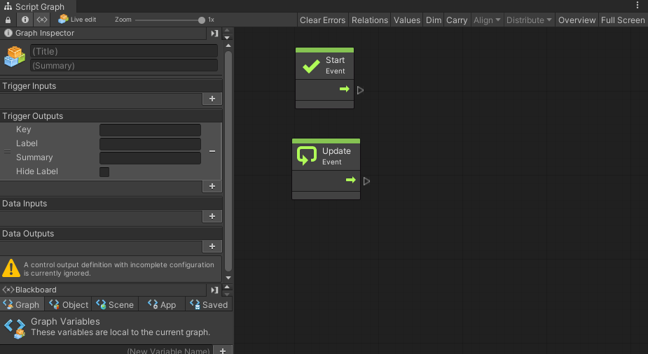
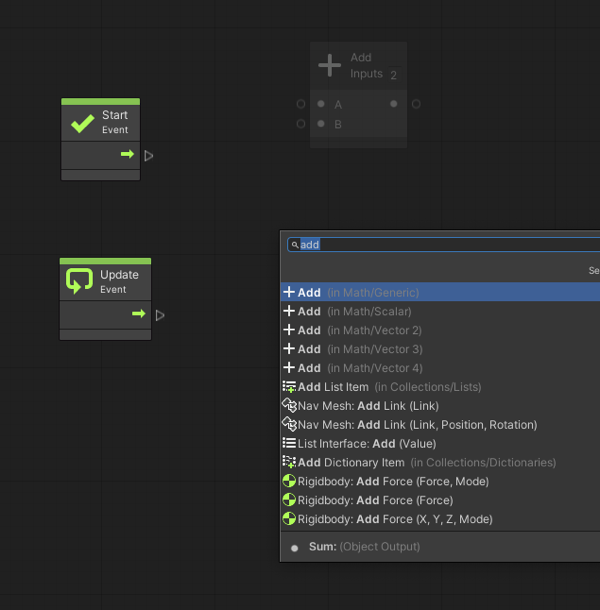
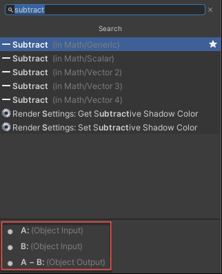
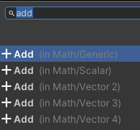
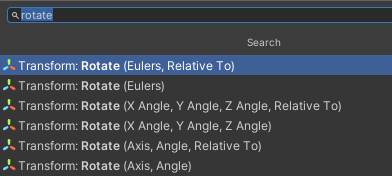
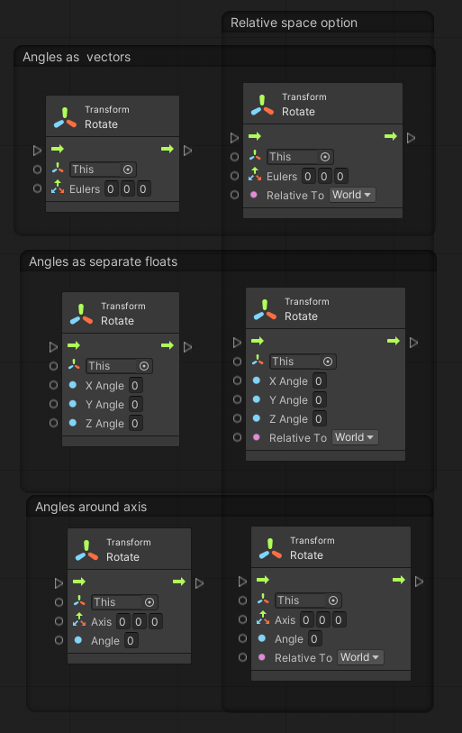
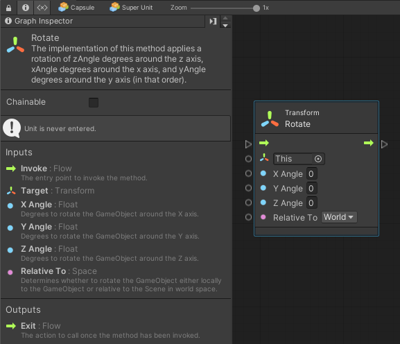
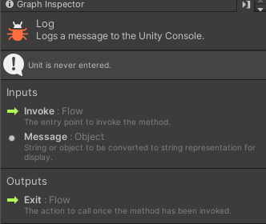
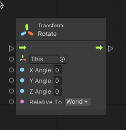
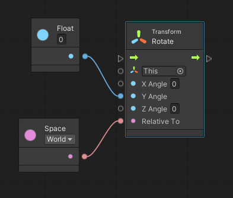

#Building a script

| **Note**                                                     |
| :----------------------------------------------------------- |
| For versions 2019/2020 LTS, download the visual scripting solution from the [Unity Asset Store](https://assetstore.unity.com/packages/tools/visual-bolt-163802). |

Units are the most basic element of computation in visual scripting. In other visual scripting languages they are called nodes or actions. Units are visually represented as "blocks" in a script graph, with input and output ports.

###Units

Units are the most basic element of computation in visual scripting. Units can do a wide variety of things; for example, they listen for an event, get the value of a variable, invoke methods on components and game objects.

Units use connections to indicate in what order they should be called and to pass values from one another. 

###Creating Units

By default, there are over 23 000 available units in visual scripting. They include the entire Unity scripting API, as well as all the methods and classes from custom scripts and third party plugins. Finally, there are  additional utility units for math, logic, variables, loops, branching, events, and coroutines.

Units are well organized in a simple, searchable creation menu called the fuzzy finder.

To display the fuzzy finder, right-click anywhere in the empty grid. Browse through the categories or search in the top field to quickly find a unit. 

New units appear dimmed out. This is a useful predictive debugging feature as visual scripting  warns you that their value is never used. 

The fuzzy finder provides a preview documentation of each unit before it is created. For example, for the Subtract unit, there is a short description of what it does and of its ports.

###Overloads

Some units have multiple variations, which are called overloads.

For example, there are four Add units: one for scalars, and one each for 2D vectors, 3D vectors, and 4D vectors. In this case, use their category to distinguish them.

Some method units have parameter overloads. Usually these variations are for convenience and each accomplishes roughly the same thing. Some overloads allow for more specific configuration than others.

For example, the Rotate Transform unit has six overloads. Two of them take the angles as a single euler angle vector, two other take it as three separate float components in X / Y / Z, and the last two take it as an angle relative to the axis. In each pair, one specifies the relative space, while the other assumes that you're specifying angles in world space. 

Here are six overloads for the rotate unit.

Until you are used to the available options, expect some trial and error to find the right overload. Use the built-in documentation or the Unity manual to assist you in distinguishing each variation.

###Reading Units

In the following example of the Rotate Transform unit, the first thing to note is the blue glow around the edge that indicates that this is the selected unit. When a unit is selected, its options and documentation shows in the Graph Inspector.

The top part of a unit is its header; it's a quick summary of what the unit does. In this case, the header  informs that it is invoking the Rotate method on a Transform component.  

###Unit Inspector

The unit inspector is made up of the following:

- At the top is the title and summary for the unit, which provides a quick overview of what it does.
- Below that, visual scripting displays all the warnings for the unit. 
  For example, visual scripting warns that the message is missing.
- Below that, if applicable, are the unit's settings. 
  The settings vary from unit to unit, and some units don't require settings.
- In the Inputs/Outputs is the description for each port. 

###Inline values

Some value input ports have small fields next to them. These are called Inline Values. If the port is not connected, the value of this field is used instead. Although most common types support inline values, not all types do. Inline values are useful to keep graphs tidy by avoiding the creation of literal units for every value input port.

For example, these two graphs are equivalent:

